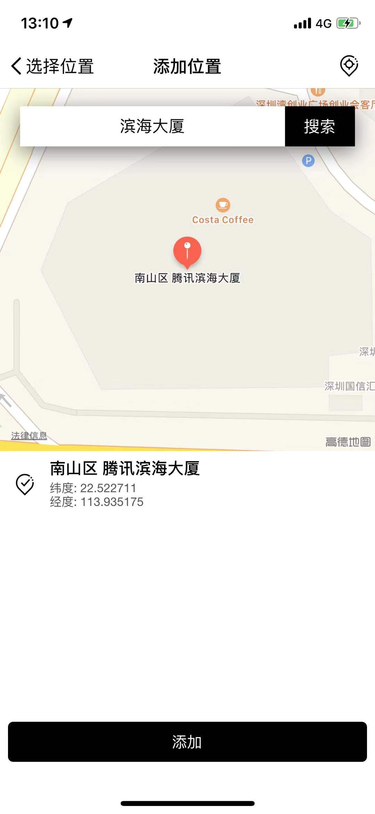
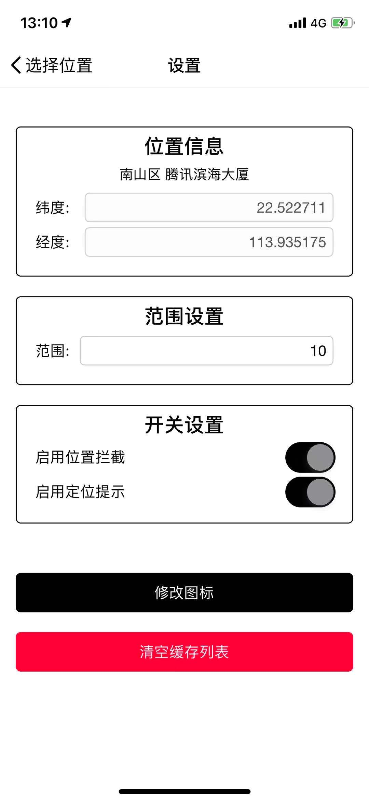
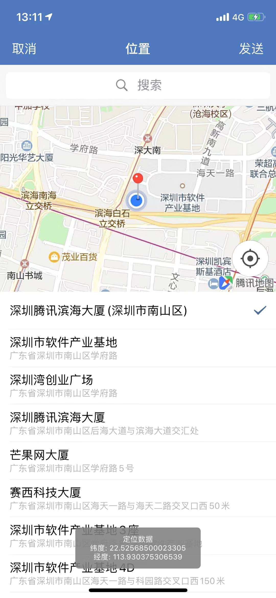

### TLocationPlugin

> iOS 版本企业微信等软件虚拟定位，仅为个人学习 hook 以及移植非越狱手机实验（防hook 以及验证签名的App没有针对性处理）

### 功能

- [x] 设置定位信息

- [x] 保存当前地点定位信息

- [x] 地图搜索地点保存定位信息

- [x] 多个定位地点缓存

- [x] 设置是否 toast 提示定位信息

- [x] 更改 App 图标（iOS 13 暂未处理）

## 使用方法

- 依赖 `python3`处理 APP 图标, `pip3 install -r requirements.txt`

- 编译内部修改版本的`yololib`， 并将生成的 `yololib` 文件移动到`/usr/local/bin/`目录下(或者其他 PATH 目录内，可命令行执行 yololib 命令即可)

- 使用 [frida-ios-dump]([https://github.com/AloneMonkey/frida-ios-dump](https://github.com/AloneMonkey/frida-ios-dump)从越狱手机中 dump 出 ipa 文件，改名为`appname_origin.ipa` (`appname`为解压 App 后Payload 中.app 的名称，如企业微信为 wework_origin.ipa)

- 修改 `RunScript`文件夹中`env.sh`的环境变量`APP_NAME`和`BINARY_NAME`，`APP_NAME`是 App ipa 文件名(去除 `_origin.ipa`部分) ，`BINARY_NAME`是.app 中主二进制 target 名称(如企业微信都为 wework)

- Xcode运行 `RunScript` target

- 生成的文件为`appname_new.ipa`(如企业微信为 wework_new.ipa)

- 生成的 ipa 没有签名，可以使用 [fastlane]([https://github.com/fastlane/fastlane](https://github.com/fastlane/fastlane) 进行重签名，重签名之后就可以安装到未越狱手机上了

- 安装之后，点击五次 App 的 Window (最好点击 NavigationBar)，会打开定位设置界面

## 示例

- 设置定位界面

- 添加位置界面

- 设置界面

- 使用界面

